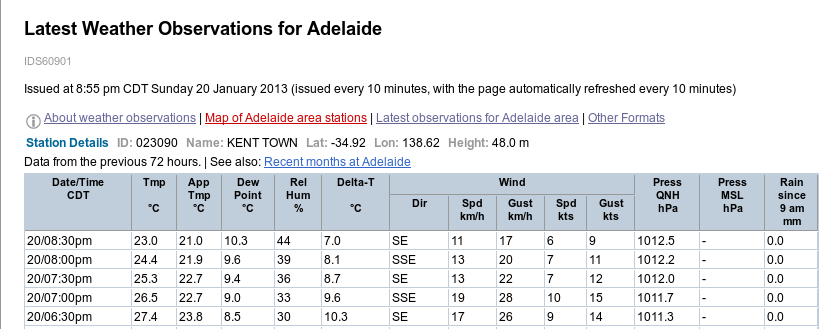
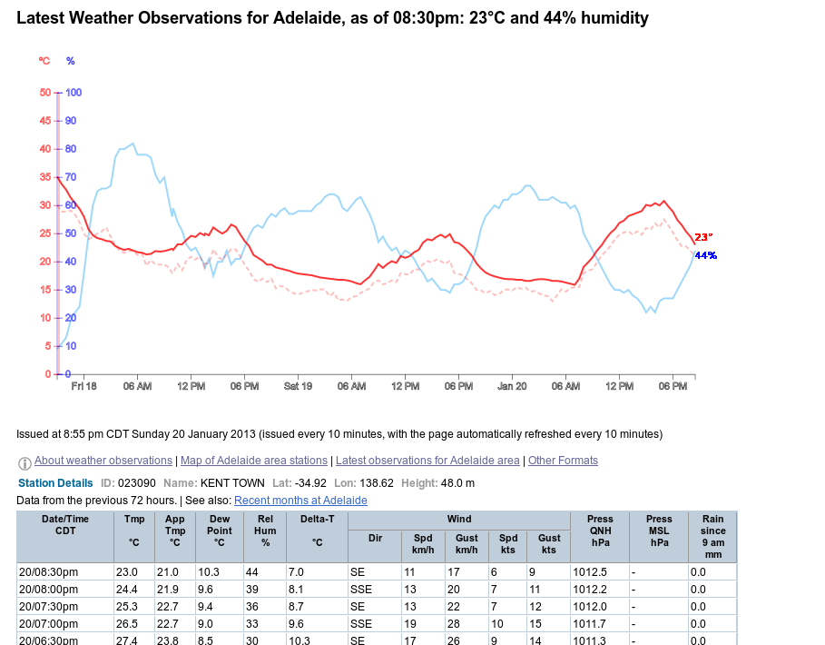

A greasemonkey userscript to add charts to the (Australian) Bureau of Meteorology's Observations pages
======================================================================================================

This is a greasemonkey script using [d3.js](http://www.d3js.org) to add a temperature and humidity graph
to the top of the Recent Observations pages,such as this one for [Adelaide](http://www.bom.gov.au/products/IDS60901/IDS60901.94675.shtml)

From

to (as it stands at the moment)

There are two here - the first one uses the data as presented in the tables on the page, the second one uses the data from a linked json file.

I'm going to keep the table one here mainly as a reference for myself and work on the json based one, as I think that can probably be gotten to do more interesting things.

It's mostly because I really wanted to have this, but it's been also a useful exercise for starting d3

There are a number of updates I'd like to do - 

 1. make it look a bit nicer (maybe feint lines in the background to 
help with seeing the values?). 
 2. at the moment it uses svg:title to do simple pop-ups on mouseover for specific values
so I'd like to update that to use jquery and tipsy instead
 3. I also want to just tidy it up somewhat - I think I've needlessly reproduced things
 4. and then after that try and work out if it's possible (and easy) to import details like the forecasted max and min from other pages. I think that'd be too difficult to do as the forecast URLs have a different code in them for each place than the observations but I'll give it a go...I've gotten the potential forecast page URLs out in the code, but they're not all there so not sure what to do with that
 5. I'd like it to default to showing a day but be easy to zoom out to show the 72hour view
 6. I'd like to add a bit of shading over the portions that are the night

But it works perfectly fine at the moment!
